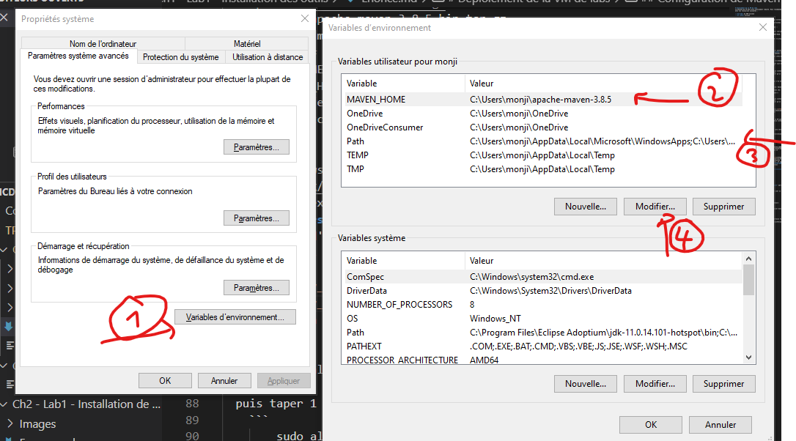
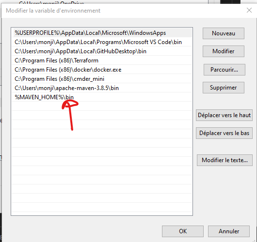

# Déploiement de la VM de labs 
La machine de TP doit etre suffisament robuste. Nous recommandons une VM avec les ressources suivantes : 
    
- **16 GO** de RAM minimum
- **4 vCPU** minimum

1. Si vous travaillez sur des VMs locales (**Virtualbox**): 
    - Un vagrantfile et son script de provisionning (**install_java.sh**) sont fournis. 
    - Utilisez les pour déployer la VM java dans Virtualbox

2. Si vous travaillez dans le cloud (**AWS dans notre cas**) : 
    - AMI :  **0057d8e6fb0692b80** 
      - C'est de la **centos 7**
    - Classe d'instance : **t2.xlarge**
    - user_data:  vous sont fournis dans le fichier **user_data.sh**
    - User de connexion : **centos**
    - Security Group : Initialement, autoriser les ports suivants : 
      -  **22** (ssh)
      -  **9000-9010**
      -  **5433-5440**
      -  **3306-3310**
      -  **80** (http par defaut)
      -  **8080-8099** (port de l'application)
## Installer firefox         
**Firefox** est un prérequis pour certains tests faits dans le projet. Il faudrait installer ce navigateur afin que les test passent.

##  Configuration de Vscode 
- Installer VS code en local.  [Voici le lien](https://code.visualstudio.com/docs/?dv=win)

- Installer l'extension : **Remote SSH de Microsoft**
    * Puis : Ctrl + shift+ P ==> tapez  **remote-ssh** ==> entrer ==> ssh vagrant@<ip_host>  ou **ssh -i <keys.pem> centos@<ip_host>** si AWS  ==> entrer ==> Choisissez **linux** si le choix est demandé ==> coller le mot de passe ==> entrer
    * Open folder (**ouvrir un dossier**): Entrer les memes infos de connexion si de nouveau demandé

- Installer l'extensions: **Extension Pack for JAVA** 
  
  !!! -- Ne télécharger aucune JDK en local

- Installer l'extensions: **Git Graph** 
  
  !!! -- il faudrait que git soit déja installé sur la VM pour pas avoir de warning d'erreur


##  Configuration de Git / GitHub
- On aura besoin de **git**, du coup vérifiez qu'il est bien installé sur la VM java. Normalement le provisionning  ou les user data l'ont déja installés pour vous, il faut juste vérifier qu'il est installé
    ```    
    git --version
    ```
- Eventuellement créer un compte sur github.com si vous n'en avez pas un

- Générer un Personal **Access token** dans github:

    User ===> settings ===> glisser tout en bas à gauche: Developer Settings
    ==> Personal Access Token ===> donner un nom au token (Ex: Centos AWS for CICD) ===>    Générer le token, le copier et le GARDER JALOUSEMENT!!!


##  Configuration de Java 11
- Vérifier que le package java-11-openjdk-devel est bien installé sur la VM java. (Normalement le provisionning ou les user data
  l'ont déja installés pour vous, il faut juste vérifier qu'il est installé)

    rpm -qa | grep java-11-openjdk-devel

Si vous etes sur **windows**, télécharger l'executable a [cette adresse](https://adoptium.net/download?link=https://github.com/adoptium/temurin11-binaries/releases/download/jdk-11.0.14.1%2B1/OpenJDK11U-jdk_x64_windows_hotspot_11.0.14.1_1.msi).

## Configuration de Maven 3.8

- Vérifier que le package maven est bien installé sur la VM java. Normalement le provisionning ou les user data l'ont déja installés  pour vous, il faut juste vérifier qu'il est installé.
    ```    
    mvn --version
    ```    
    
    On devrait avoir maven version 3.8 au minimum, et java version 11 au minimum

    Si tel n'est pas le cas, voici les commandes d'installation  : 
    
    - Sous **Linux** (en user **root**) : 
      - Tapez les commandes suivantes : 
        ```
        cd /usr/local/src/
        yum install wget -y
        wget https://downloads.apache.org/maven/maven-3/3.8.5/binaries/apache-maven-3.8.5-bin.tar.gz 
        tar -xvf apache-maven-3.8.5-bin.tar.gz 
        mv apache-maven-3.8.5 /usr/local/maven/
        echo -e "# Apache Maven Environment Variables\n# MAVEN_HOME for Maven 1 - M2_HOME for Maven 2\nexport M2_HOME=/usr/local/maven\nexport PATH=${M2_HOME}/bin:${PATH}" > /etc/profile.d/maven.sh
        chmod +x /etc/profile.d/maven.sh
        source /etc/profile.d/maven.sh
        ```
      - Forcer **maven** à utiliser **java 11**

        ```
        sudo alternatives --config java 
        ```    
          puis taper 1 + **entrer**
        ```    
        sudo alternatives --config javac 
        ```    
          puis taper 1 + **entrer**
          
          !!! -- **PS** :  Ce n'est pas une repétition, il y'a un '**c**' après **java**

    - Sous **Windows**
      - Téléchargez le binaire à [cette adresse](https://dlcdn.apache.org/maven/maven-3/3.8.5/binaries/apache-maven-3.8.5-bin.zip)
      - Ensuite, extraire celà a l'emplacement que vous souhaitez (**C:\Users\monji\apache-maven-3.8.5** pour ma part)
      - Rajouter une variable d'en nommé **MAVEN_HOME** contenant ce chemin (**C:\Users\monji\apache-maven-3.8.5**)
      - Rajouter **%MAVEN_HOME%\bin** dans la variable d'environnement **PATH** de windows

        
        
    


## Configuration de Docker
- Créer un compte sur Docker Hub :  https://hub.docker.com/ si vous n'en avez pas un
- Installez docker sur votre VM

