# Configuration de Jenkins

Jenkins étant installé, nous allons le configurer.

#### Credentials Github et Dockerhub
```mermaid
graph LR
      A[Manage jenkins] ---> B[Manage credentials] ---> C[Global]---> Token
```
##### Github
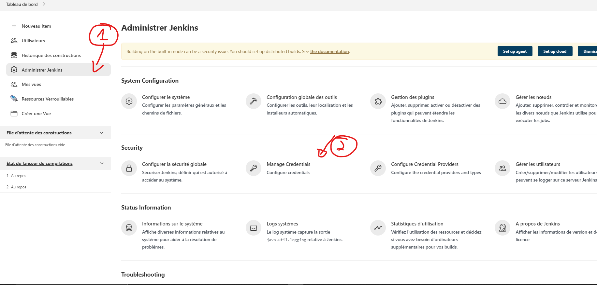
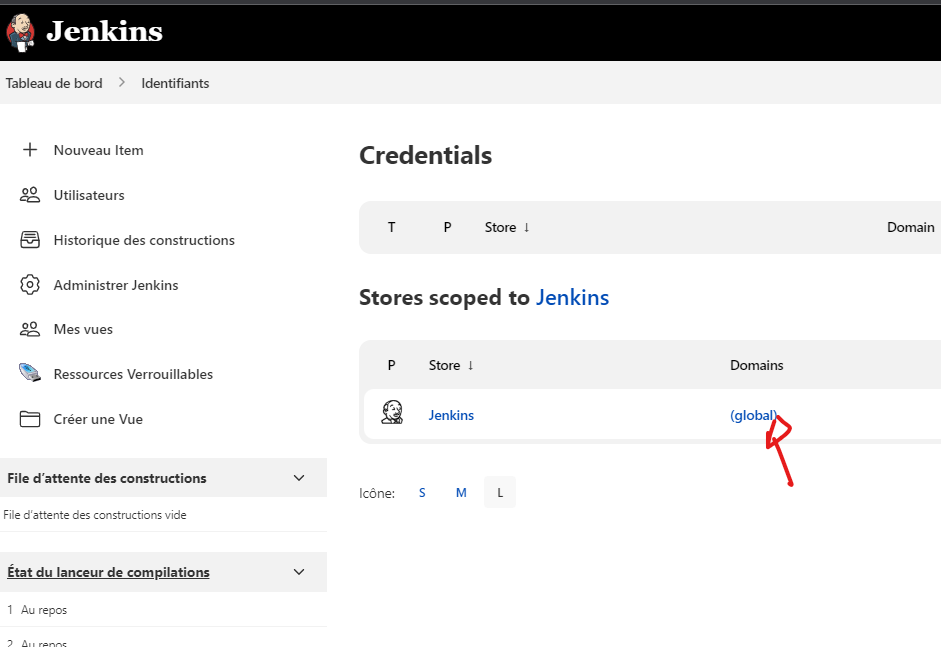

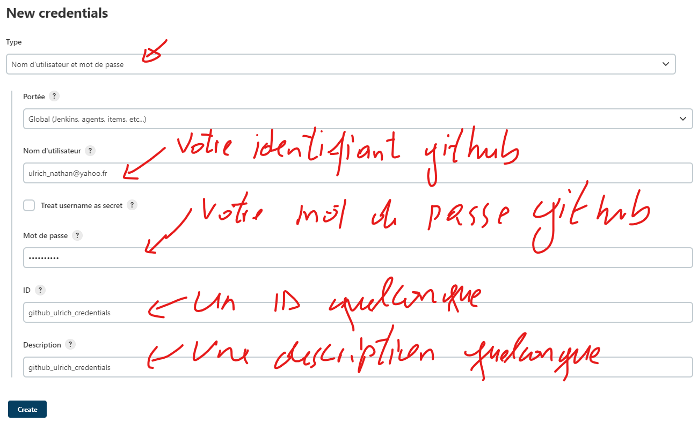

##### Dockerhub
Repéter la meme opeation que celle faite pour github

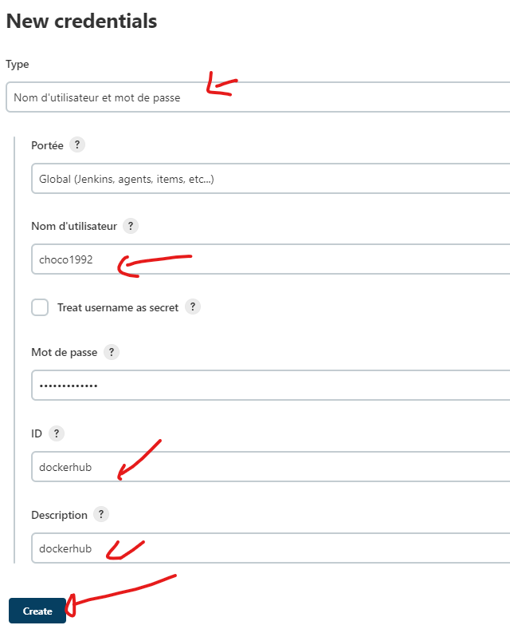

On a donc ceci : 

#### Configuration de Maven

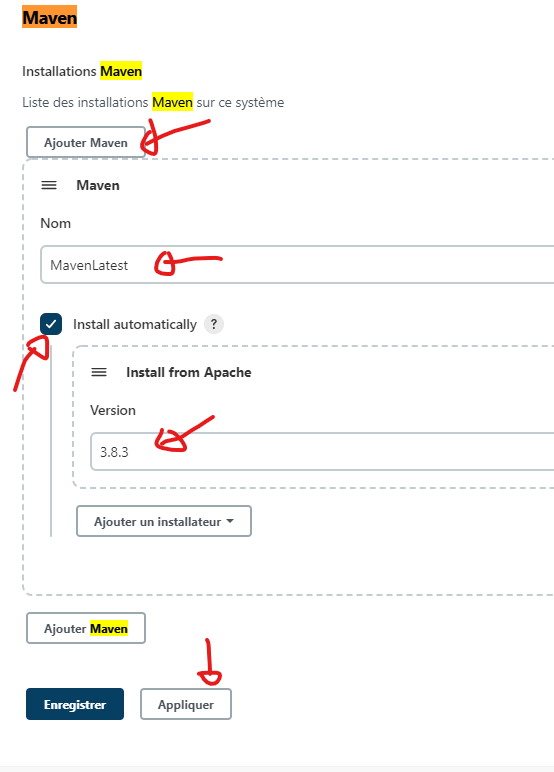

#### Configuration de Maven

#### Docker
##### installation du plugin docker

On va en profiter pour installer d'autres plugin  : **SonarQube Scanner** par exemple

Les plugins suivants seront aussi nécessaires : 
- **Email Extension Template**
  
##### Configuration  du plugin docker
Il faudrait à présent configurer le plugin docker: 

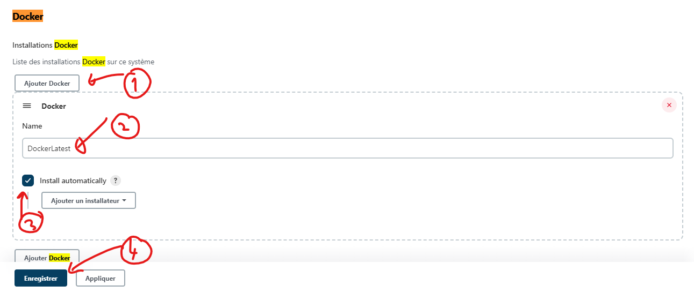

#### Configuration de Sonar
Rdv sur le serveur sonar à l'adresse suivante http://**<votre_ip>**:9000/documentation/analysis/jenkins/ et prendre connaissance de la configuration à mettre ne place.
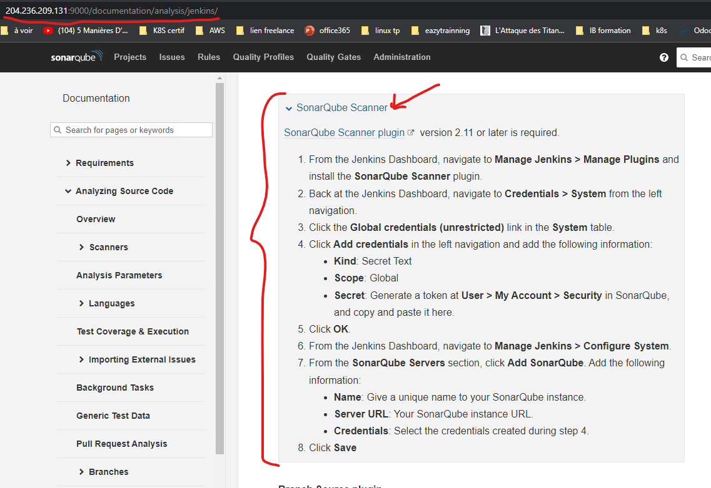

- Dans sonnar, générer un autre token pour jenkins. On l'applelara **jenkins**
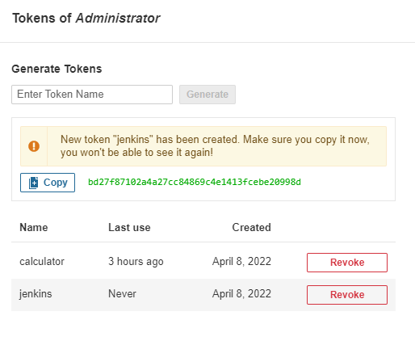
- Rajouter une credential dans jekins de type *secret Text*, qui aura comme valeur le token nouvellement généré.
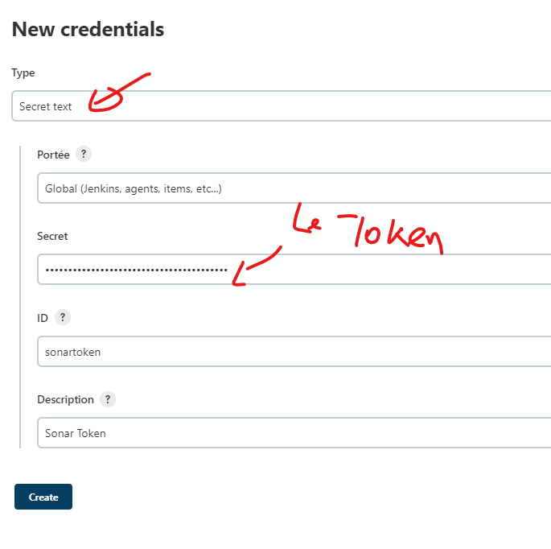

- Configuer le serveur sonarQube dans jenkins. l'url sera **http://host.docker.internal:9000** car les deux container ne sont pas dans le même réseau bridge

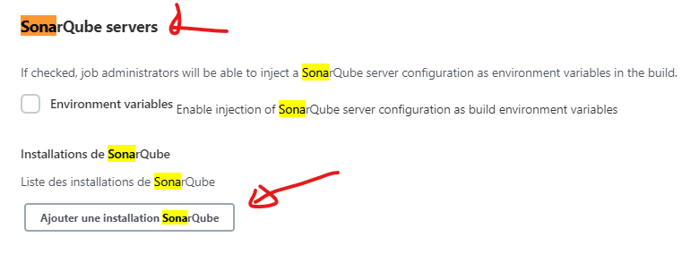

- Configurer un webhook dans sonar
  - nom :  **JenkinsWebhook**
  - url : **https://host.docker.internal:8080/sonarqube-webhook/**
 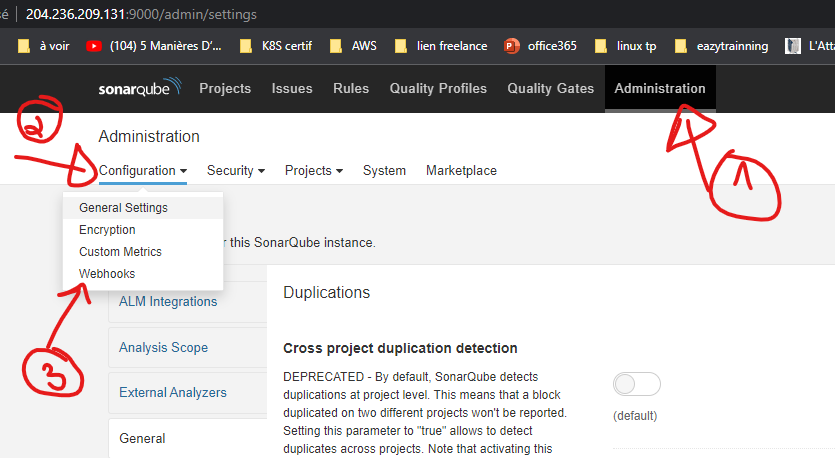
 Ensuite cliquer sur create et cféer un nouveau webhook
 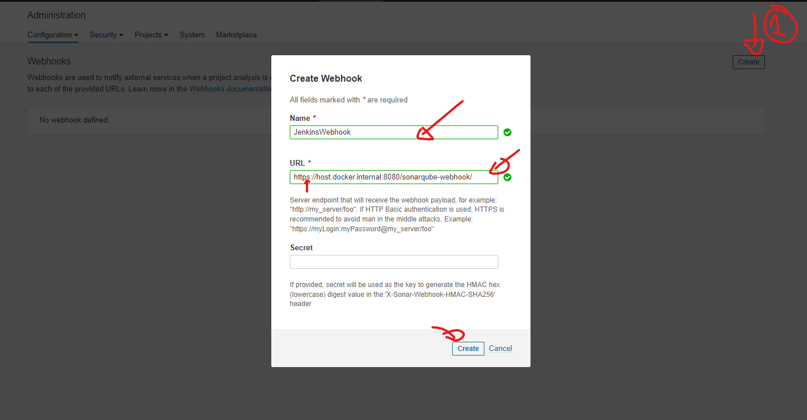
 On aura donc ceci : 
 

 #### Configuration des mails
 On va configurer l'envoie des mail, via une boite mail google
 
 Ensuite on va à la section des notification par email et on configure le serveur smtp
 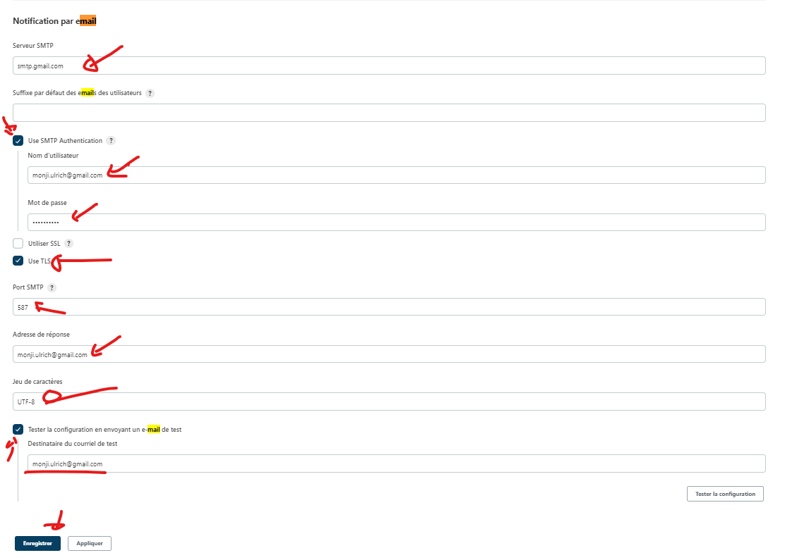
 Dans le cas de l'utilisation de google, pensez à desactiver la sécurité à l'adresse **https://myaccount.google.com/security**
 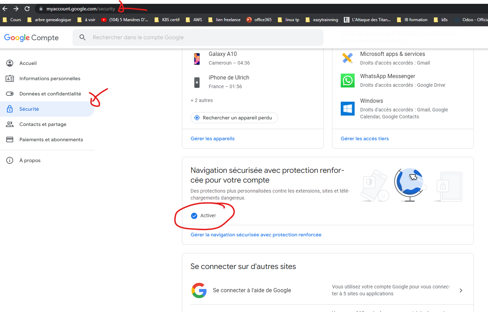